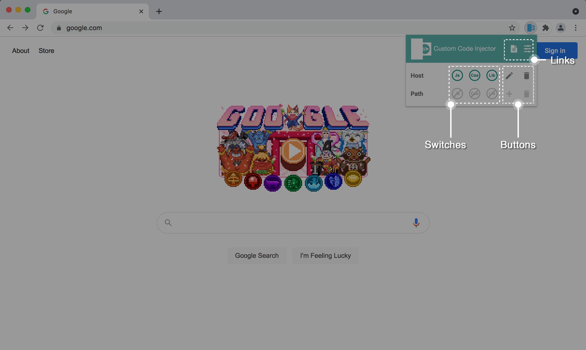
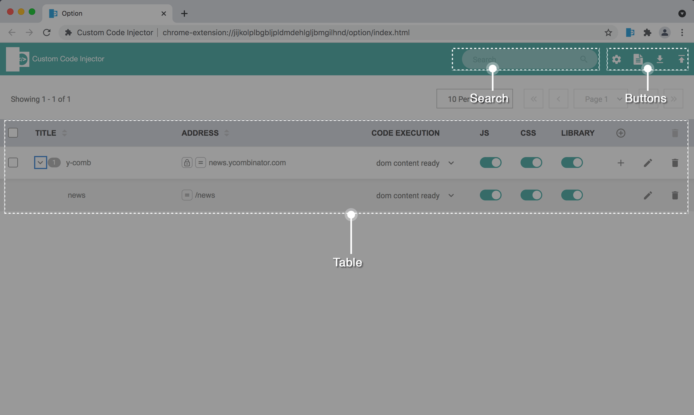

# Chrome Extension: Custom Code Injector
> User guide and Support page for chrome custom code injector extension

#### Links:
* [Chrome Extension Store Link](https://TODO)
* [Quick Tutorial Video (Youtube)](https://www.youtube.com/watch?v=CRjLD6vdq5E)

#### Table of Contents:
* [About the Extension](#about-the-extension)
* [UI Layout](#ui-layout)
    * Extension Icon (Popup)
    * Extension Option (List View)
    * Extension Option (Edit View)
* [FAQ](#faq)
* [Privacy](#privacy)
* [Issues/Support](#issues\/support)
* [Release Notes](#eelease-notes)

----------------

## About the Extension
* Another free extension as well as final personal practice project prior to developing a product. Compared to the last css selector capture extension, it is more complex due to the nature of dashboard ui. As per past project, I take care of the work from start to finish, i.e. design to code including 100% test coverage.
* The plugin gives you control to run custom javascript code, css code as well as 3rd party libraries (javascript/css) on top of a website
* THe extension comes with a default rule for ycombinator site, have a play to see how it works. You can delete it afterwards.
* The extension focuses on "pasting" the ready-to-run code in the editor area. The builtin editor is not intended to be a full blown proper editor. For best development experience, please use a proper code editor to write the code and possibly optimize it prior to pasting them.

## UI Layout

1. **Extension Icon (Popup)**

    

    This popup allows quick control to any rules you have already created. It also allows a quick addition of rules you haven't created. The top row of switches and buttons is relative to host rule while the bottom is relative to path rule.
        
    * Links: 

        Opens Userguide, extension option in a new tab

    * Switches: 

        When webpage matches the rule host and/or path, these switches will be enabled. They allow javascript code, css code, 3rd party libraries (active ones only) to be injected in the matched webpage

    * Buttons:

        Add allows you to quickly add a rule that is not yet defined for the host or path (when a host rule exists). Edit and delete is applicable for existing rule only.

2. **Extension Option (List View)**

    

    This is the default option page when you click the extension option. Compared to the icon popup, it gives a overview of all the rules that have been defined and a way to further edit a specific rule.

    * Search: 
    
        filter rules that matches title and/or address in Table

    * Buttons:

        * Setting: 
        
            control how the table is displayed, default values when adding a rule etc
        
        * Userguide: 
        
            open userguide page
        
        * Import rules: 
        
            import a json file containing all the rules and replace the existing ones
        
        * Export rules: 
        
            export/save the rules as json file
    
    * Table:    
        
        * `TITLE` column: 

            Basically an ID for the rule defined. The badge shows the number of path rules under a host rule.
        
        * `ADDRESS` column: 

            For host, this means host with port. For path, it means the pathname. The lock switch means that it must be HTTPS protocol and is only applicable for host. The `=` switch means the host/path must be exact match, else it is a match if it contains.

        * `CODE EXECUTION` column:

            This specifies when the injection will happens: either when content is ready or when everything is fully loaded including images. This applies for javascript/css code as well as libraries.

        * `JS`/`CSS`/`LIBRARY` columns: 

            When the switch is on, it means it will inject the code. Keep in mind for libraries, it also need the `active` switch to be on.

        * `+` column:

            Either add host rule (top, rounded button) or add path rule

        * "EDIT" column:

            This will take you to Edit View in Extension Option for more detailed editing

        * "DELETE" column

            Delete multiple host rules or single host/path rule

3. **Extension Option (Edit View)**

    

    This gives finer editing control such as the title, host/path, code and libraries under a specific rule. Some controls are same as list view just styled differently.
    
    * Buttons: 

        * `<`: 

            Go back to list view
    
        * "Delete": 

            Delete either host/path rule

        * `+`:

            Add path rule (only applicable to when editing host rule)

    * Sidebar:

        Navigate between each rule. As per list view, badge next to host rule shows how many path rules there are.

    * Tabs:

        * Content of each tab let you specify what is to be injected (e.g. js/css code, libraries) in the webpage
        * Each tab contains a switch which is similar to list view. It will inject the code when the switch is on.
        * `JS` and `CSS` contain builtin editor where code can be input/pasted

    * Table (Library Table):

        * Adding a library is simple and is similar to adding a host rule. All it needs is a title and a URL. 
        * The type of library defaults to javascript when it is created, make sure you specify type to `CSS` if the library is a css library. Keep in mind that `async` is not applicable to CSS type.

## FAQ
* Drag and drop feature is not available for sorting the rules
* Sorting of rules is not saved
* To inject a 3rd party library, you need both library switch to be on as well as the "active" switch of that library to be on
* When necessary, depending on the value of Content Security Policy Header of a site, the extension will override value to allow the custom javascript/stylesheet code to run as well as 3rd party libraries to be injected. However this only happens when the host/path of a rule matches the site.

## Privacy
* The extension does NOT collect any data or send data to third party. 
* Current Chrome versions (e.g. v.75) offer the additional control (apart from extension settings page) to switch on any Extension upon clicking the Extension Icon while by default it is disabled.

## Issues/Support
* As Manifest V3 is on its way and Manifest V2 (which this extension is based on) will be phased out, the extention will no longer work due to Google new introduction on Security regarding running inline code or inject 3rd party libraries. 
* As majority of time is spent prior to initial release, the maintenance will be transitioned to casual mode for this project. For bugs/issues, please provide details and try to be as specific as possible. For example:
    * URL
    * Steps to reproduce the issue
    * What should be expected and what is the actual result
    * etc

## Release Notes
* 1.0.0 (2021.09.13)
    * Initial Release